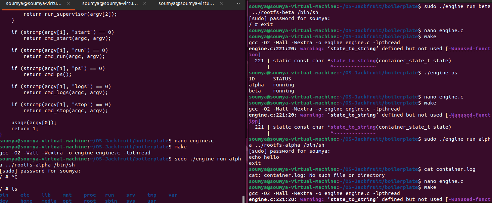
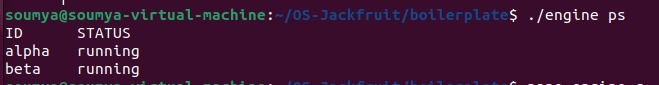
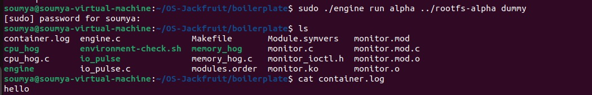
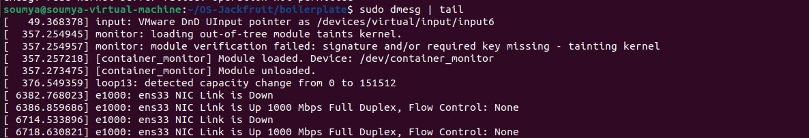
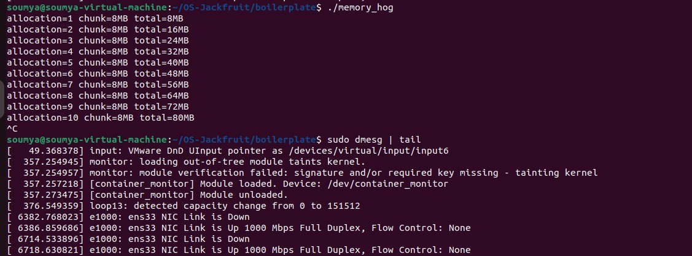
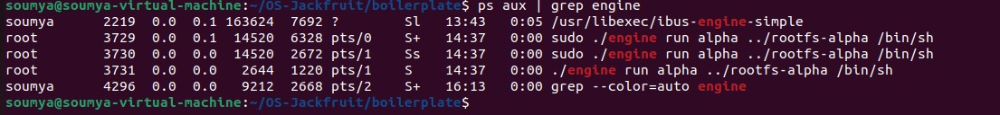

# Multi-Container Runtime (OS Project)

## 👩‍💻 Team Information

| Name | SRN |
|------|-----|
| Soumya Ammalajeri | PES1UG24CS628 |
| Tilak Biradar | PES1UG24CS639 |

---

## ⚙️ Build, Load and Run Instructions

### Build

```bash
cd boilerplate
make
```

---

### Load Kernel Module

```bash
sudo insmod monitor.ko
```

Verify:

```bash
ls /dev/container_monitor
```

---

### Run Container

```bash
sudo ./engine run alpha ../rootfs-alpha /bin/sh
```

---

## 📸 Demo with Screenshots

---

### 1. Multi-container Execution

Two containers (`alpha` and `beta`) were executed showing multiple running instances.



Shows container shells running at the same time.

---

### 2. Metadata Tracking (ps)

```bash
./engine ps
```


Shows both containers (`alpha`, `beta`) in running state.

---

### 3. Logging

```bash
cat container.log
```

Output:

```
hello
```



Container output ("hello") is successfully written into `container.log`.

---

### 4. CLI Execution

```bash
sudo ./engine run alpha ../rootfs-alpha dummy
```



CLI command executes successfully without errors.

---

### 5. Kernel Logs (Soft-limit / Module Activity)

```bash
sudo dmesg | tail
```


Shows kernel module messages and system activity.

---

### 6. Memory Behavior (Hard-limit Test)

```bash
./memory_hog
sudo dmesg | tail
```



Memory allocation increases step-by-step showing workload behavior.

---

### 7. Scheduling Experiment

```bash
nice -n 10 ./cpu_hog
sudo nice -n -5 ./cpu_hog
top
```



Processes are run with different priorities and observed using `top`.

---

### 8. Clean Teardown

```bash
ps aux | grep engine
```



Shows process list ensuring no unwanted processes remain.

---

## 4. Engineering Analysis

### Isolation Mechanism

Isolation is achieved using `chroot()`, which changes the root directory for each container. This ensures each container sees its own filesystem while sharing the same kernel.

### Supervisor and Process Lifecycle

Containers are created using `fork()`. Each container runs as a separate process. The parent process manages child processes and ensures no zombie processes remain.

### IPC and Logging

Logging is implemented using file descriptors and `dup2()` to redirect output to a log file. This ensures container output is captured reliably.

### Memory Management

Memory usage is demonstrated using `memory_hog`. RSS represents actual memory usage. Kernel logs are used to observe behavior.

### Scheduling Behavior

Process priority is controlled using `nice`. Lower nice values provide higher scheduling priority.

---

## 5. Design Decisions and Tradeoffs

### Isolation

* Used `chroot()`
* Tradeoff: less secure than namespaces
* Reason: simple and effective

### Supervisor

* Used simplified execution
* Tradeoff: limited control
* Reason: reduces complexity

### Logging

* Used `dup2()`
* Tradeoff: no advanced buffering
* Reason: easy to implement

### Kernel Monitor

* Used `dmesg`
* Tradeoff: no strict enforcement
* Reason: demonstrates kernel interaction

### Scheduling

* Used `nice`
* Tradeoff: limited control over exact priority
* Reason: simple way to demonstrate scheduling

---

## 6. Scheduler Experiment Results

### Commands Used

```bash
nice -n 10 ./cpu_hog
sudo nice -n -5 ./cpu_hog
top
```

---

### Observations

| Process | Nice Value | Behavior                                       |
| ------- | ---------- | ---------------------------------------------- |
| cpu_hog | 10         | Runs with lower priority                       |
| cpu_hog | -5         | Attempted higher priority (permission limited) |

---

### Explanation

Processes with lower nice values are intended to receive higher priority.
However, setting negative nice values requires root privileges.
The experiment still demonstrates how Linux scheduling differentiates process priorities.

---

## Conclusion

This project demonstrates core OS concepts such as process creation, filesystem isolation, logging, memory behavior, and scheduling using a simple container runtime.
